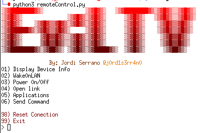

# 📺 **EvilTV - Remote Control Tool for TVs** 📺
### By: Jordi Serrano [@j0rd1s3rr4n0](https://github.com/j0rd1s3rr4n0)

---

## Description

**EvilTV** is an advanced remote control tool designed primarily for **Samsung TVs**. With **EvilTV**, you can remotely control your TV, automate actions, manage applications, and even simulate **Denial of Service (DoS)** attacks for stress testing.

Currently, **EvilTV** supports only **Samsung TVs**, but it is designed to be extendable to other brands in the future.

### Key Features:
- Full remote control of your **Samsung TV** using commands.
- Manage installed applications on the TV (open, close, install).
- Support for sending **Wake On LAN** packets.
- Simulate **Denial of Service (DoS)** attacks with multiple modes.
- Interactive interface to select and manage applications from the Samsung TV store.

---

## 📋 **Installation**

### Prerequisites:

1. **Python 3.x**: Ensure that you have Python 3.x installed on your system.
2. **Required Libraries**: All necessary dependencies are listed in the `requirements.txt` file.

### Installation Steps:

1. Clone the **EvilTV** repository to your local machine:
   ```bash
   git clone https://github.com/your_username/evil-tv.git
   ```

2. Navigate to the project directory:
   ```bash
   cd evil-tv
   ```

3. Install the required dependencies:
   ```bash
   pip install -r requirements.txt
   ```

---

## 🚀 **Usage**

### Main Menu

Once you run the main program (`remoteControl.py`), you'll be presented with an interactive menu offering several options to control the TV. These options include:

1. **Display Device Info**: Show technical information about the TV.
2. **Wake On LAN**: Send a **Wake On LAN** packet to turn on the TV.
3. **Power On/Off**: Turn the TV on or off.
4. **Open URL**: Open a URL in the TV's browser.
5. **Applications**: List the applications installed on the TV.
6. **Send Command**: Send remote control commands to the TV.
7. **View Available Apps**: Show all available apps from the Samsung TV store.
8. **Select App by APP ID**: Install or interact with an app by its APP ID.
9. **Start DoS**: Start a simulated **Denial of Service (DoS)** attack in one of the available modes.
10. **Stop DoS**: Stop any ongoing **DoS** attack.

### Running the Program

To run the program, simply execute the following command:

```bash
python remoteControl.py
```

### DoS Attack Modes

EvilTV provides three simulated **Denial of Service (DoS)** attack modes that can be activated from the main menu:

1. **Open and close apps indefinitely**: Simulate an attack by continuously opening and closing apps.
2. **Send Wake On LAN and power off indefinitely**: Simulate an attack by turning the TV on and off repeatedly.
3. **Close all apps indefinitely**: Simulate an attack by closing all applications on the TV.

You can select the desired **DoS** mode by choosing option 9 in the main menu.

---

## ⚙️ **Advanced Configuration**

The `config.cfg` file is automatically generated when the program is run for the first time. It stores connection details and TV features such as:

- The TV's IP address.
- Support for features like **FrameTVSupport**, **GamePadSupport**, etc.
- Information about the firmware version and operating system.

You can manually edit this file if you need to modify connection parameters.

---

## 🛠 **Technologies Used**

- **Python**: The main programming language used.
- **SamsungTVWS**: A library used to interact with Samsung TVs.
- **PrettyTable**: Used to display data tables in a structured format in the console.
- **WakeOnLAN**: Used to send **Wake On LAN** packets.
- **Scapy**: Used for network packet manipulation.
- **Asyncio**: Handles background tasks such as simulated DoS attacks.

---

## 📄 **License**

This project is licensed under the MIT License. For more details, refer to the [LICENSE](LICENSE) file.

---

## 🤝 **Contributing**

Contributions are welcome! If you'd like to improve **EvilTV**, feel free to open an **issue** or submit a **pull request** to the repository.

---

## 📞 **Contact**

If you have any questions, suggestions, or issues, feel free to contact me:

- GitHub: [@j0rd1s3rr4n0](https://github.com/j0rd1s3rr4n0)

---

**EvilTV** is continuously evolving and growing. Thank you for using and contributing to the project! 🎉